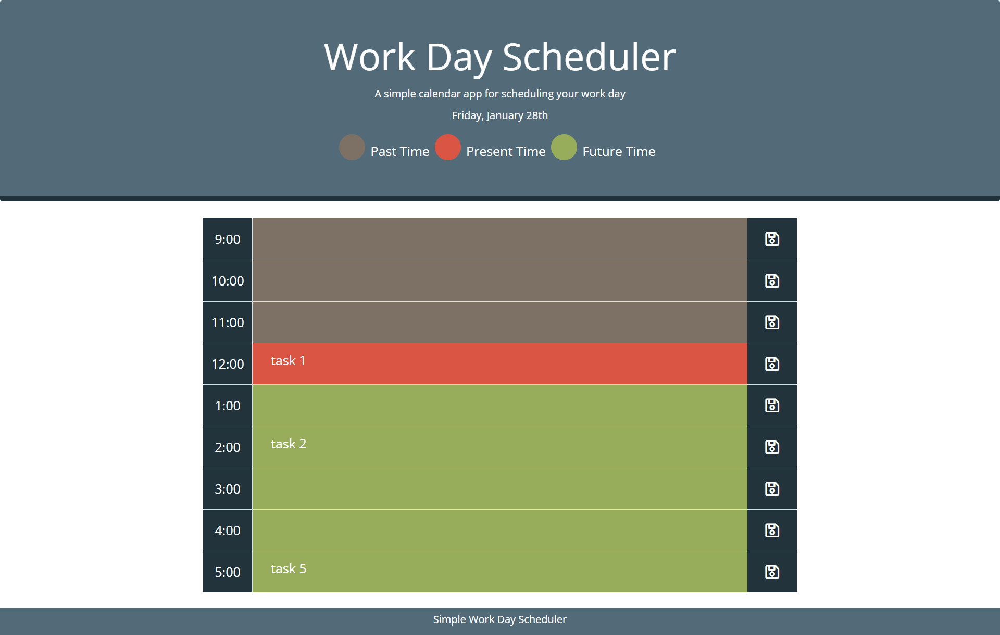

# Schedule-my-day
## Simple Work Day Schedule
A simple work day scheduling app

### What was your motivation?
- I wanted to be able to plan out my current day.

### Why did you build this project?
- Time management is tough, having a schedule helps alot.

### What did you learn?
- How to use moment library
- Using jQuery
- Create HTML elements with jQuery
- Create CSS elements with jQuery
- Better understanding of eventListeners and localStorage

## Sample Website
[DEMO LINK](https://bdubz93.github.io/Schedule-my-day/) 
## Installation
- Click the green code button on GitHub
- Select clone, GitHub Desktop, or download ZIP
- Open downloaded folder and open index.html
## Usage
- To plan out your day quickly!

## Credits
- https://momentjs.com/docs/
- https://api.jquery.com/html/
- https://api.jquery.com/css/
- https://developer.mozilla.org/en-US/docs/Web/API/Window/localStorage

## License
- [APACHE 2.0 LICENSE](license)
---